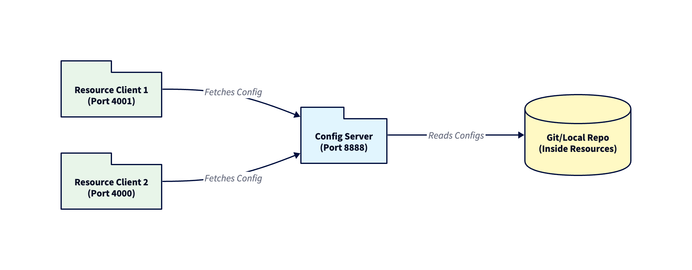

# Spring Config Server & Client Demo

This project demonstrates a centralized configuration management system using **Spring Cloud Config**. It consists of a **Config Server** that serves properties to multiple **Resource Clients** (microservices), ensuring decoupled and dynamic configuration.

## 🚀 Purpose and Architecture

### What is Spring Cloud Config?
In a microservices architecture, managing configuration files for dozens of services can be a nightmare. **Spring Cloud Config** provides a server-side and client-side support for externalized configuration in a distributed system. 

- **Config Server**: A central place to manage external properties for applications across all environments.
- **Config Client**: A Spring Boot application that fetches its configuration from the Config Server on startup (or refresh).

### 🏗️ Application Architecture Diagram

Below is the high-level architecture of this demo:


---

## 📦 Project Components

### 1. Config Server (`config-server`)
- **Port**: `8888`
- **Role**: Reads configuration files from `classpath:/config-repo` and serves them to clients.
- **Config Storage**: Uses a local directory inside `src/main/resources/config-repo` simulating a Git repository.

### 2. Resource Client 1 (`resource-client-1`)
- **Port**: `4001` (assigned via Config Server)
- **Role**: A sample microservice consuming config.
- **Endpoints**: CRUD operations on `/api/records`.

### 3. Resource Client 2 (`resource-client-2`)
- **Port**: `4000` (assigned via Config Server)
- **Role**: A second sample microservice to demonstrate multiple clients.
- **Endpoints**: CRUD operations on `/api/records`.

---

## 🔄 Request-Response Flow

How a client gets its configuration and handles a user request:


---

## 🛠️ How to Run

1.  **Start the Config Server**
    Navigate to `config-server` and run:
    ```bash
    ./mvnw spring-boot:run
    ```
    Ensure it starts on port **8888**.

2.  **Start the Clients**
    Open two new terminals.
    Run `resource-client-1`:
    ```bash
    ./mvnw spring-boot:run
    ```
    Run `resource-client-2`:
    ```bash
    ./mvnw spring-boot:run
    ```

3.  **Verify Configuration**
    - Client 1 should be running on **4001**.
    - Client 2 should be running on **4000**.
    - Check logs to confirm they fetched config from `localhost:8888`.

## 🧪 API Documentation & Testing

A **Postman Collection** is included in the root directory: `spring-config-demo.postman_collection.json`.

Import this file into Postman to test all CRUD operations for both clients.

### Endpoints (For both clients)

| Method | URL | Description |
| :--- | :--- | :--- |
| `GET` | `/api/records` | Get all records |
| `POST` | `/api/records` | Create a new record |
| `GET` | `/api/records/{id}` | Get record by ID |
| `PUT` | `/api/records/{id}` | Update record |
| `DELETE` | `/api/records/{id}` | Delete record |
